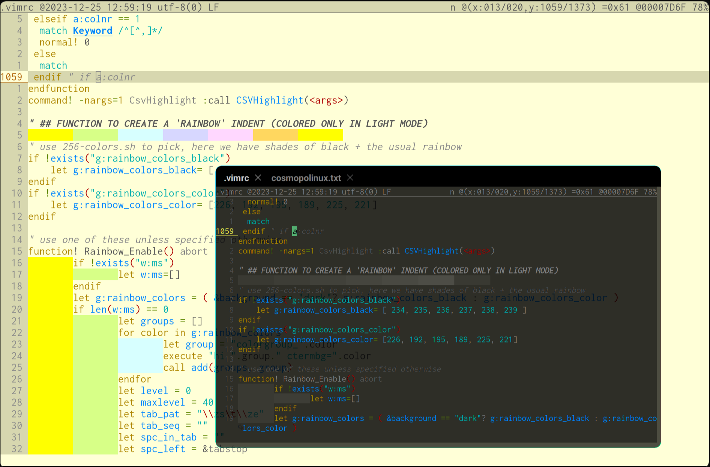
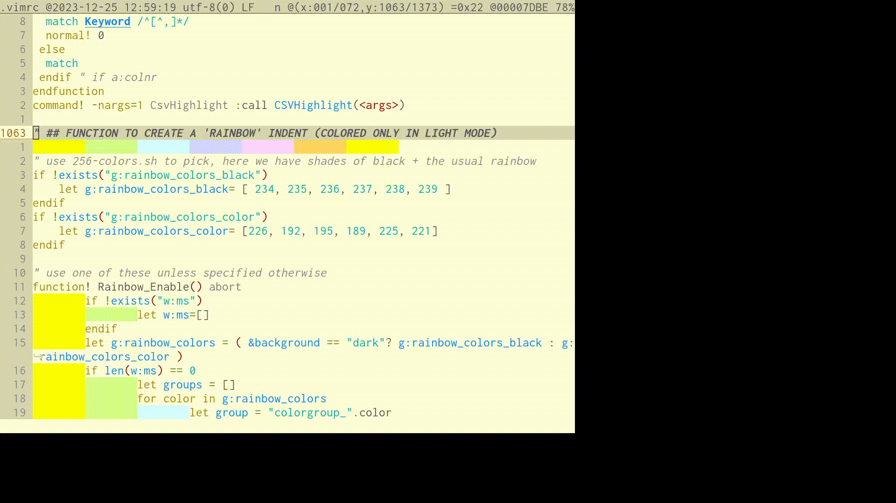
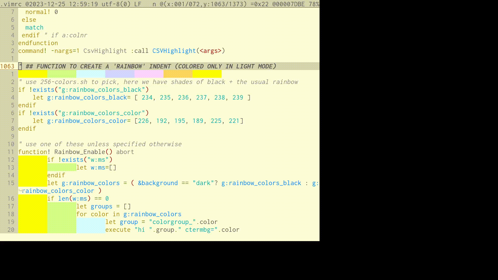
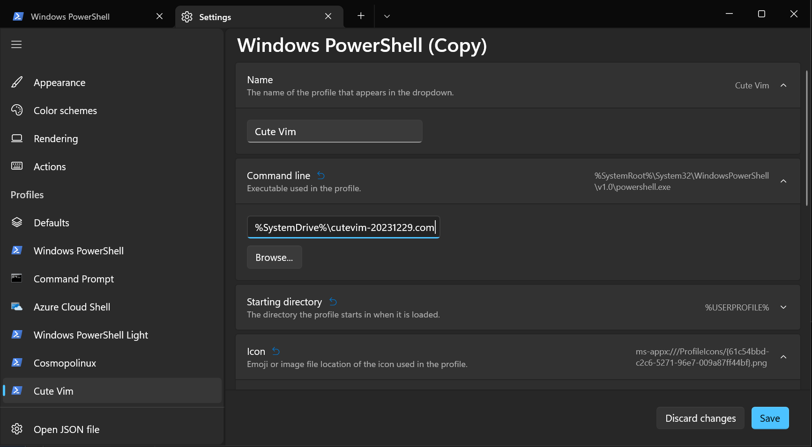
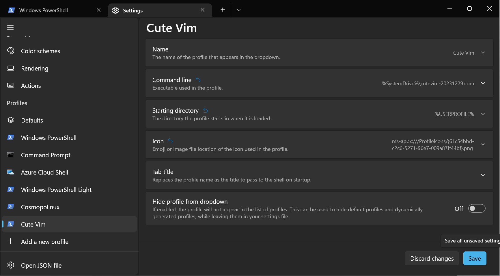
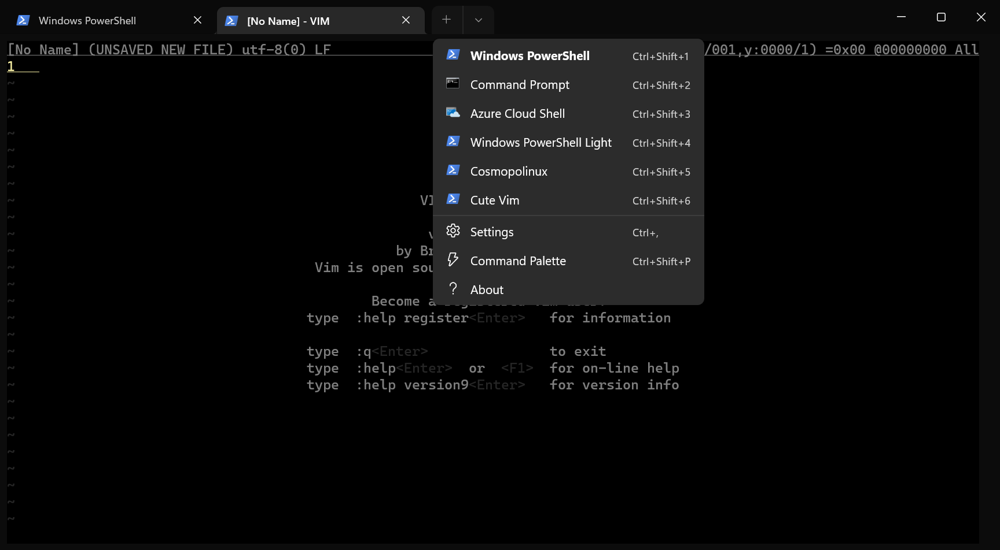

# CuteVim in pictures

There's both a light and dark mode:

You can move the current line by holding the Alt key, and quickly change the appearance with the F8/F9/F10 keys:

You can also move blocks of text by selecting a range (first hold the Shift key then use the arrows) which can then be moved around by holding both Control and Shift and using the arrow keys:

# TLDR; love the pics, love the concept, I want to test it, how can I quickly do that?

Just  rename it vim.com and run it:

 - `wget https://raw.githubusercontent.com/csdvrx/CuteVim/main/release/cutevim-20231229.com`

 - `cp cutevim-20231229.com vim.com`

 - `chmod +x ./vim.com`

 - `./vim.com -u /zip/usr/share/vim/vimrc`

The last line is important: without it, if you already have a .vimrc, it would be read.

# What is CuteVim?

CuteVim is a minimal configuration file (TODO: it's not all included in .vimrc yet) to give sensible defaults to Vim, like:

 - a tabline on top, showing the filename and ISO timestamp, the encoding (with the unicode byte-order-mark if applicable), the position in a (x=column, y=row) space with the hexadecimal value of the character you see and the position within the file in box hexadecimal and percentage

 - a line counter on the left, with both the current line number (hilighted and underlined to quickly see it) and the relative line numbers (dimmer) to type vim commands that apply to a length in lines (like `:d5` to delete the next 5 lines)

 - saving backups of files in ~/.vim/backup every time you save, and keeping an undo-per file

 - restoring the cursor position to where you last edited the file

 - selecting lines with the shift keys and the arrows

 - moving lines, blocks of lines or words with Alt and the arrows, and text or blocks of text with Ctrl-Shift and the arrows

 - having separate functions for Control keys and their results, for example to separate Tab (which indent the current line) and Ctrl-I (which jumps the cursor position following the edit history, best used with Ctrl-O) thanks to [xterm 'modifyotherkeys' (MOK)](https://invisible-island.net/xterm/modified-keys.html)

 - showing otherwise invisible characters (like tabs and control codes, or spaces on empty lines) using colors to avoid breaking copy-paste

 - playing ball with Wayland by having one shared copy-paste buffer

 - overriding dark themes to replace the uggly muddy darkgreys by a pure #000000 black: this is ideal on OLED screens which can do pitchblack and give you a higher contrast

# Are these defaults really sensible?

If you don't like readline or Windows shortcuts, some of my choices may be questionable.

Fortunately, the .vimrc should be easy to understand thanks to all the comments, and you should be able to adjust it to match your preferences.

PS: If you don't have an OLED screen, don't comment out `autocmd ColorScheme * call OLED_Black()` around line 1162. Instead, go buy an OLED screen! It's really worth it!!

# How can I quickly change the apperance?

Press F8 to show hidden characters, F9 to cycle through the themes, F10 to toggle the rainbow indent

The .vimrc is made to recognize which terminal you are using, and start in either a light or dark profile: I use both foot (light) and wezterm (dark).

If you use Windows Terminal, you can also configure UUIDs to recognize the profile

# Why are the Control keys mapped to emacs-like readline commands?

Because I feel bad when Ctrl-A doesn't get me to the beginning of the line, and Ctrl-E to the End.

I like it better when Ctrl-K also cuts from the cursor to the end of the line, and Ctrl-U to the beginning.

I'm fully happy when all the Ctrl keys "work as they should", like:

 - if Control-Arrows can jump around words and lines,

 - while both Ctrl-W and Ctrl-Backspace removes the previous word,

 - and both Ctrl-S and Ctrl-Delete remove the next word

I often have different shortcuts to do the same thing because I'm whimsical and I like to use one or the other depending on the mood :)

# Why can't I do copy-paste in Xorg?

I use Wayland (to be precise, [the best composer of all for a keyboard centric workflow: hyprland](https://github.com/hyprwm/Hyprland)) so Xorg is not well tested.

I will try add other functions for Xorg if the defaults don't work.

# Why make CuteVim?

I wanted to have a cute editor for [☪ ☮$m✡✝🍏linux](http://github.com/csdvrx/cosmopolinux) without having to carry too many files around, because I sometimes forget to take them in a tarball or a zip file.

So CuteVim configuration mostly fit within .vimrc, the one file I will not forget to take!

It's also much easier to make a release: it only takes `./zip -r vim.com usr/share/vim/vimrc` to refresh it.

# How can I make my own CuteVim APE?

Use `refresh.sh` which does the following:

## Get clean binaries

    rm -f vim.com zip.com unzip.com
    wget https://cosmo.zip/pub/cosmos/bin/vim -O vim.com
    wget https://cosmo.zip/pub/cosmos/bin/zip -O zip.com
    wget https://cosmo.zip/pub/cosmos/bin/unzip -O unzip.com

## Add vimrc in the right place

    ./zip -r vim.com usr/share/vim/vimrc

## How do we know it's the right place?

First, check what's the default path for this version

    ./vim.com --version | grep usr/share

You'll see `fall-back for $VIM: "/zip/usr/share/vim"`

Now, check with `--strace` what's happening:

    vim.com --strace 2> vim.strace.txt
    # (then type :q!)

Use grep on the strace file to skip to the important parts:

    grep zip.usr.share.vim vim.strace.txt |grep defaults.vim | less

    grep zip.usr.share.vim vim.vanilla.strace.txt |grep vimrc

You'll see:

grep zip.usr.share.vim vim.vanilla.strace.txt |grep vimrc

    SYS 1646170 1646170         12'999'983 fstatat(AT_FDCWD, "/zip/usr/share/vim/vim90/defaults.vim", [{.st_size=4'952, .st_blocks=2'560/512, .st_mode=0100644, .st_dev=0x172120, .st_ino=0x1097916, .st_blksize=65'536}], 0) → 0 ENOTSUP
    SYS 1646170 1646170         13'032'512 openat(AT_FDCWD, "/zip/usr/share/vim/vim90/defaults.vim", O_RDONLY) → 3 ENOTSUP

And earlier than this:

    SYS 1646170 1646170         12'917'060 fstatat(AT_FDCWD, "/zip/usr/share/vim/vimrc", [n/a], 0) → -1 ENOENT
    SYS 1646170 1646170         12'920'202 openat(AT_FDCWD, "/zip/usr/share/vim/vimrc", O_RDONLY) → -1 ENOENT

This is why we do `./zip -r vim.com usr/share/vim/vimrc`, to embed a vimrc from `./usr/share/vim/vimrc` inside the zip part of the APE, which maps to the path `/zip/usr/share/vim/vimrc`

Running vim.com again with strace, the file is seen:

     SYS 1650340 1650340        114'662'106 fstatat(AT_FDCWD, "/zip/usr/share/vim/vimrc", [{.st_size=42'484, .st_blocks=14'848/512, .st_mode=0100644, .st_dev=0x7c98aa, .st_ino=0x10b712f, .st_blksize=65'536}], 0) → 0 ENOTSUP

42484 is the size, ENOTSUP is just because of O_RDONLY

# Italics are missing, and the APE is not using Solarized

This means you are using the old version (Xmas release, 2023-12-25) which didn't include ./usr/share/vim/vimfiles/after and ./usr/share/vim/vimfiles/colors, and only included the .vimrc

CuteVim depends on after/syntax/ for italics within .vim files, and colors/ for the [default Solarized theme](https://en.wikipedia.org/wiki/Solarized)

Instead of fitting everything inside a single .vimrc, the `refresh.sh` now includes a few extra assets from usr/share/vim/vimfiles:

 - usr/share/vim/vimfiles/colors/solarized8_low.vim

 - usr/share/vim/vimfiles/colors/solarized8_high.vim

 - usr/share/vim/vimfiles/colors/solarized8.vim

 - usr/share/vim/vimfiles/colors/solarized.vim

 - usr/share/vim/vimfiles/colors/solarized8_flat.vim

 - usr/share/vim/vimfiles/after/syntax/python.vim

 - usr/share/vim/vimfiles/after/syntax/vim.vim

This unifies the APE and the non-APE experience

# On Windows, do I need WSL to use CuteVim?

No you don't. CuteVim will work with or without WSL: just double-click on cutevim binary to start it.

Note that drag-and-drop to files into the window is not supported yet (TODO: open a new tab withim Vim), so if you use Vim a lot, it may be easier to have CuteVim as a keyboard shortcut.

# How can I add a direct access to CuteVim as a Windows Terminal profile?

Copy cutevim-20231229.com to C:\ using the File Explorer: you will need administrative permissions. If you don't have them, use another folder like `%UserProfile%` which usually goes to your folder in C:\Users\ (personally, I prefer to have basic utilities in the root of the C: drive)

Open Windows Terminal settings in the drowndown, or use the default shortcut (press Ctrl+,)

Inside the settings, select Profiles on the left, go to "+ Add a new profile"

Click on "Duplicate" to duplicate the Windows Powershell profile

Click on "Name" to rename it to "Cute Vim"

Click on "Command line" to replace it by "%SystemDrive%\cutevim-20231229.com"

The end results should look like the following

Click on "Save": you can now call CuteVim directly from the dropdown with a shortcut: Ctrl+Shift+6

If you prefer the light theme, type `set background=light` or edit `./usr/share/vim/vimrc` then refresh the assets with `./refresh.sh`

Note that some shortcuts are not supported yet:

 - the appearance shortcuts F8/F9/F10 (F8 generates ^[[19~, F9 generates ^[[20~, F10 generates ^[[21~)

 - the Alt, Shift and Control selections (Windows Terminal remaps Ctrl-Shift-Up to the buffer scroll)

Contributions are welcome, ideally as patches to the vimrc: this is to avoid changing Windows Terminal defaults unless it's absolutely required (such as to override defaults like the Ctrl-Shift-Up)

# TODO

Coming next, in no specific order:

 - make the function looking for .git/HEAD recursive

 - improve Windows Terminal support

 - suggest some sensible Windows Terminal config options as a .json patch
